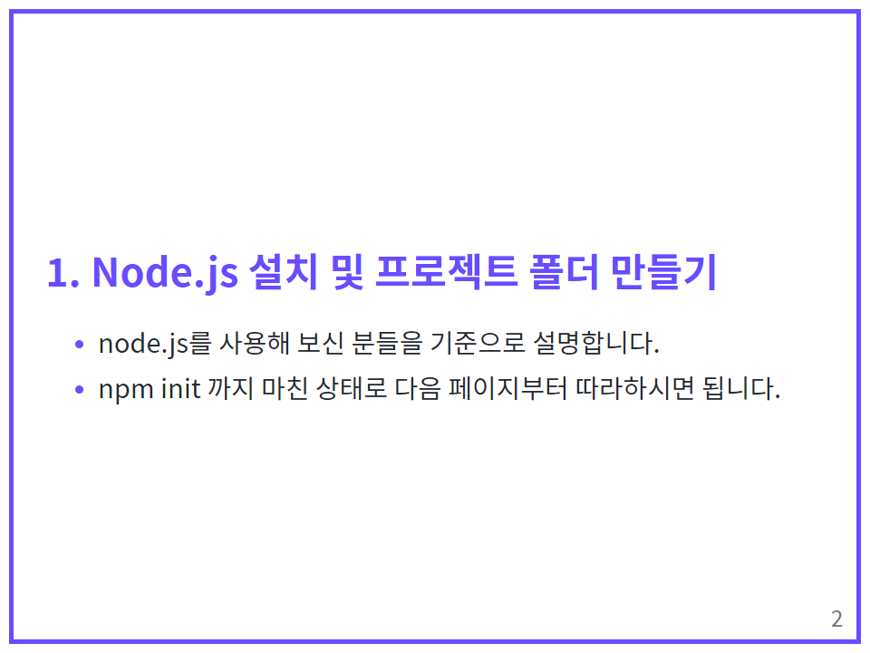

# Marp project for [@chat_g1pt](https://www.instagram.com/chat_g1pt/)
## build image
```bash
cd md/프로젝트 폴더
npm start
```

## 작성 가이드
```
---
theme: default
size: 4:3
paginate: true
_paginate: false
marp: true
style: |
   @import url('https://fonts.googleapis.com/css2?family=Noto+Sans+KR:wght@100;300;400;500;700;900&display=swap');
   
   :root {
      --my-color: #694cff;
      font-family: 'Noto Sans KR', sans-serif;
   }

   section {
      word-break: keep-all;
      padding: 0 50px;
   }
   section::before {
      content: "";
      position: absolute;
      top: 0;
      left: 0;
      width: 930px;
      height: 690px;
      border: 5px solid var(--my-color);
      margin: 10px;
   }
   section.noborder::before {
      display: none;
   }

   section.center {
      text-align: center;
      padding: 0 200px;
      background-color: var(--my-color);
   }
   section.center::before {
      left: 50%;
      transform: translateX(calc(-50% - 10px));
      width: 690px;
      border: 5px solid #fff;
   }
   section.center h1 {
      color: #fff;
      font-size: 2em;
   }

   h1 {
      font-size: 1.5em;
      font-weight: 700;
      color: var(--my-color);
   }

   li::marker {
      color: var(--my-color);
      font-size: 0.8em;
   }
   li li{
      font-size: 0.8em;
   }
   marp-pre {
      background-color: #161b22;
      border-radius: 10px;
      padding: 10px;
   }
   marp-pre>code {
      color: white;
      font-size: 0.8em;
   }
---
<!-- _class: center -->
```
로 시작 시




디자인으로 편집 가능