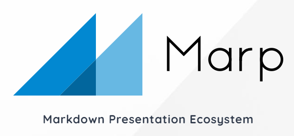
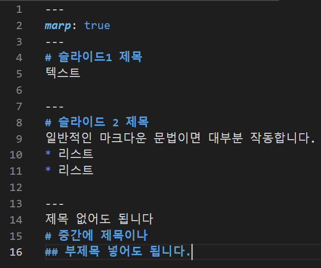
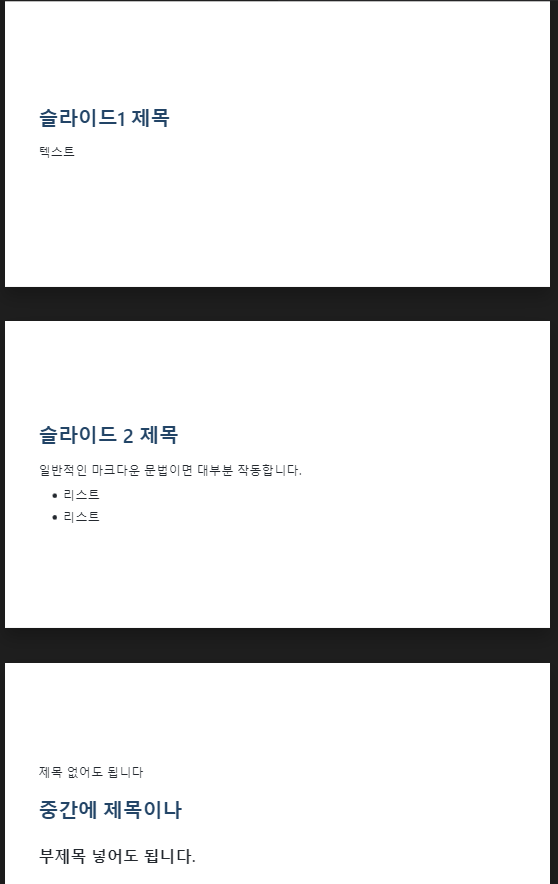
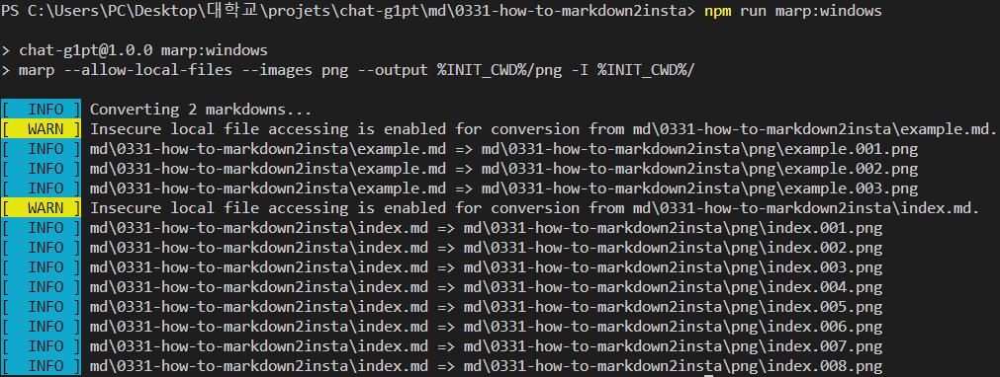

<!-- _class: center -->
# 마크다운으로 인스타 게시물 만들기
프로젝트 세팅 예시:
https:// github.com/ **raipen/chat-g1pt**

---
# 1. Node.js 설치 및 프로젝트 폴더 만들기
* node.js를 사용해 보신 분들을 기준으로 설명합니다.
* npm init 까지 마친 상태로 다음 페이지부터 따라하시면 됩니다.

---
# 2. marp cli 설치

* 설치: ```npm install @marp-team/marp-cli```
* npm script가 아니라 바로 marp 명령어를 사용하고 싶다면, ```npm install -g @marp-team/marp-cli``` 로 설치합니다.
* Marp: Markdown to Presentation Slide 라이브러리
* 마크다운을 슬라이드로 변환하고, 이미지로 저장

---
# 3. 마크다운 작성하기
* ```.md``` 파일을 만들고 다음과 같이 작성합니다.
   * 각 슬라이드는 ```---```로 구분합니다.
   * 슬라이드 내부는 일반적인 마크다운 문법으로 작성하시면 됩니다.
```md
# 슬라이드1 제목
텍스트

---
# 슬라이드 2 제목
일반적인 마크다운 문법이면 대부분 작동합니다.
* 리스트
* 리스트

---
제목 없어도 됩니다
# 중간에 제목이나
## 부제목 넣어도 됩니다.
```
더 자세한 문법: https://marpit.marp.app/markdown 

---


# 작성 예시
<br>
<br>
<br>
<br>
<br>
<br>
<br>
<br>
<br>
<br>
<br>
<br>
<br>

---
# 4. marp cli로 슬라이드 만들기
* marp 명령어로 슬라이드를 만들 수 있습니다.
* ```marp --images [png|jpeg] 파일이름```
* --output 옵션: 이미지 파일들의 저장 위치를 지정
* ex) ```marp --images png --output ./png index.md```
* package.json
```
{
   ...
   "scripts": {
      "marp:windows": "marp --allow-local-files --images png --output %INIT_CWD%/png -I %INIT_CWD%/",
      "marp:linux": "marp --allow-local-files --images png --output $INIT_CWD/png -I $INIT_CWD/"
   }
   ...
}
```
* 위와 같이 작성 시 ```npm run marp:운영체제``` 로 실행 가능
   * 명령어를 실행한 디렉토리의 모든 md 파일을 png로 변환

---
# 빌드 예시


---
# + 디자인 설정
* 첫 슬라이드 위에 다양한 설정들을 할 수 있습니다.

```
---
theme: default
size: 4:3
class:
   - orange
paginate: true
marp: true
style: |
   section.orange {
      word-break: keep-all;
      padding: 0 50px;
      background-color: orange;
   }
---
첫 슬라이드 마크다운
밑에는 일반적인 마크다운 문법으로 작성하시면 됩니다.
```
자세한 문법은 https://marpit.marp.app/directives